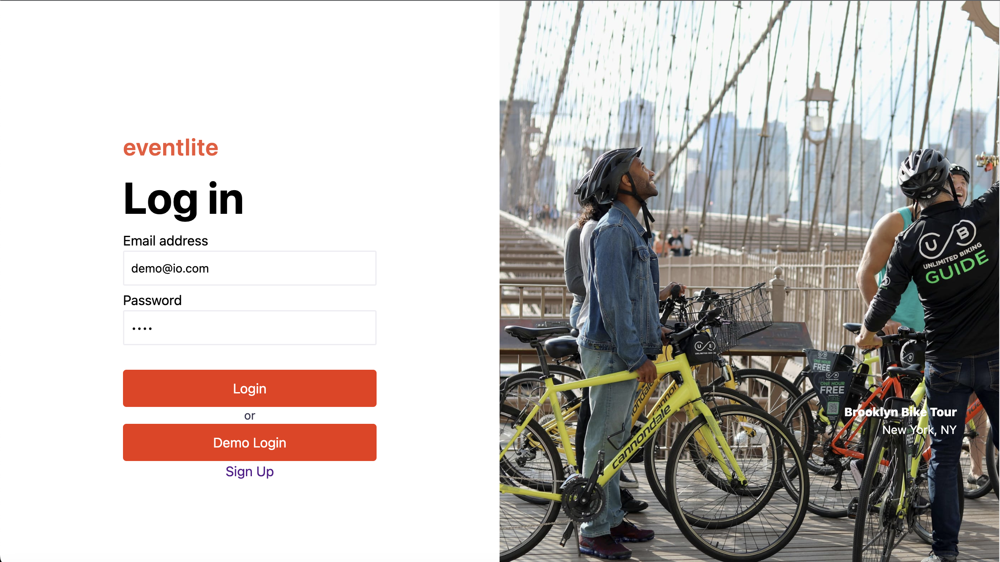
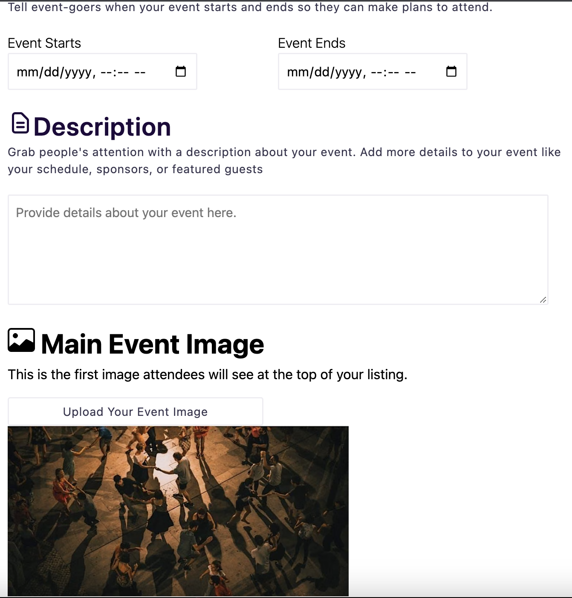

# Eventlite

Eventlite is a full stack clone of [Eventbrite](https://www.eventbrite.com/) that allows users to find events as well as create their own events.

[Live link for Eventlite](https://event-lite.onrender.com/)

## Core Technologies

The Eventlite full stack app that is hosted on Render that utilizes React Redux for the frontend and is supported with a Ruby on Rails backend. Data storage is handeled by AWS s3 for images while PostgreSQL is utilized as the database for non-image based data (e.g. users, events, tickets, etc.). During the development of the backend, Postman was utilized for testing GET, POST, PUT, DELTE requests.

- React Redux
- html/css
- Rails
- PostgreSQL
- AWS s3
- Render hosting
- Postman (for testing))

## User Authorization

Login and Signup pages have complete error handling with validations on the backend as well as DOM manipulation on the form elements to provide users with information to correctly submit form. The user can view a typing effect upon clicking the Demo Login button in the signin page. The javscript setTimeout method was utilized to create the effect by displaying each chracter set intervals to give the impression that the login information is being typed. Example can be found below.

```javascript
const handleDemoLogin = (e) => {
  e.preventDefault();
  setEmail("");
  setPassword("");
  document.getElementById("login-email-input").style =
    "border-color:rgb(238, 237, 242)";
  document.getElementById("login-password-input").style =
    "border-color:rgb(238, 237, 242)";
  setTimeout(typeEmail, 50);
  setTimeout(typePassword, 1000);
  setTimeout(loginDemoUser, 1500);
};

const typeEmail = () => {
  demoEmail.forEach((nextChar, ind) => {
    setTimeout(() => {
      setEmail((currChar) => currChar + nextChar);
    }, 75 * ind);
  });
};
```



## Creating/Editing Events

There is full CRUD functionailty for modifying events. A number of technical challenges included handling image files as an input from users, providing live previews of the images, and maintaing fetched data in the react-redux state with mutliple asynchronus functions. A custom createFormEvent async function is defined to use an instance of FormData to collect both the image file and text based form data. The photoUrl is also utilized to create a File object that is used to render a preview of the uploaded image.

```javascript
const createFormEvent = (formData) => async (dispatch) => {
  const res = await csrfFetch(`/api/events`, {
    method: "POST",
    body: formData,
  });
  if (res.ok) {
    history.push("/");
  }
};

const handleSubmit = async (e) => {
  e.preventDefault();
  setErrors([]);

  const formData = new FormData();
  formData.append("event[title]", title);
  formData.append("event[category]", category);
  ...

  if (photoFile) {
    formData.append("event[photo]", photoFile);
  }

  dispatch(createFormEvent(formData, setPhotoFile)).catch(async (res) => {
    let data;
    try {
      data = await res.clone().json();
    } catch {
      data = await res.text();
    }
    if (data?.errors) setErrors(data.errors);
    else if (data) setErrors([data]);
    else setErrors([res.statusText]);
  });
};
```



## Future Features

- Tickets
- Likes (registering to backend)
- Searching & Category Filtering
